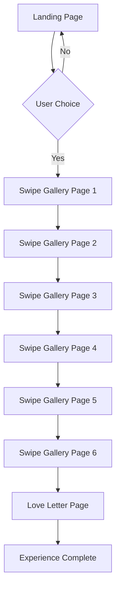

## 1. Product Overview

A romantic Valentine's Day web application that creates an interactive journey from proposal to personalized love letter. The app features dynamic button interactions, a swipeable photo gallery with synchronized audio, and culminates in an auto-typing love letter.

This product solves the problem of creating memorable digital romantic experiences, helping users express love through interactive storytelling with photos, music, and personalized messages.

## 2. Core Features

### 2.2 Feature Module

Our Valentine's Day web application consists of the following main pages:

1. **Landing page**: Interactive proposal with dynamic buttons, romantic typography, smooth animations.
2. **Swipe gallery**: 6-page touch-enabled carousel with full-screen photos, romantic messages, unique background songs.
3. **Love letter page**: Auto-typing personalized letter with synchronized romantic music, elegant typography.

### 2.3 Page Details

| Page Name        | Module Name            | Feature description                                                                                                                    |
| ---------------- | ---------------------- | -------------------------------------------------------------------------------------------------------------------------------------- |
| Landing page     | Proposal question      | Display "Would you be my valentine?" with elegant typography and romantic styling.                                                     |
| Landing page     | Dynamic buttons        | Two buttons "Yes" and "No" with progressive resizing: "No" shrinks 15% per click, "Yes" grows 20% per click, smooth 300ms transitions. |
| Landing page     | Navigation             | Seamless transition to gallery upon "Yes" selection with romantic animation.                                                           |
| Swipe gallery    | Touch carousel         | 6-page swipeable interface similar to Spotify Wrapped with spring physics and 500ms transitions.                                       |
| Swipe gallery    | Photo backgrounds      | Full-screen spouse photos with romantic overlay messages, auto-fit to screen dimensions.                                               |
| Swipe gallery    | Audio integration      | Unique background song per page that auto-plays when active, with pause/play controls.                                                 |
| Swipe gallery    | Page indicators        | Visual indicators showing current page position in the 6-page sequence.                                                                |
| Love letter page | Auto-typing effect     | Reveal personalized love letter at 50 characters per second with realistic typewriter animation.                                       |
| Love letter page | Audio synchronization  | Final romantic song plays simultaneously with typing animation, perfectly timed.                                                       |
| Love letter page | Completion celebration | Romantic visual effects when letter finishes typing.                                                                                   |

## 3. Core Process

The user flows through a romantic journey designed to create an emotional connection:

**Primary User Flow:**

1. User lands on proposal page with "Would you be my valentine?" question
2. User interacts with buttons - "No" button progressively shrinks while "Yes" button grows
3. Upon selecting "Yes", user transitions to the swipe gallery
4. User swipes through 6 romantic pages with photos and music
5. Final page reveals auto-typing love letter with synchronized music
6. Experience completes with romantic celebration

## 4. User Interface Design

### 4.1 Design Style

* **Primary colors**: Deep romantic red (#DC143C), soft pink (#FFB6C1), elegant white (#FFFFFF)

* **Secondary colors**: Warm gold (#FFD700), soft cream (#FFF8DC)

* **Button style**: Rounded corners with romantic gradients, subtle shadows, hover effects

* **Typography**: Elegant serif fonts for headings (Playfair Display), clean sans-serif for body (Open Sans)

* **Layout style**: Full-screen immersive experience with minimal distractions

* **Icons/emoji**: Heart icons, romantic symbols, subtle animations

### 4.2 Page Design Overview

| Page Name        | Module Name        | UI Elements                                                                                                              |
| ---------------- | ------------------ | ------------------------------------------------------------------------------------------------------------------------ |
| Landing page     | Proposal section   | Centered romantic typography with gradient background, heart animations, elegant button styling with smooth transitions. |
| Landing page     | Button interaction | Responsive buttons with hover states, progressive scaling effects, romantic color schemes, smooth 300ms CSS transitions. |
| Swipe gallery    | Photo display      | Full-screen photos with romantic overlay filters, smooth swipe gestures, page indicators at bottom.                      |
| Swipe gallery    | Audio controls     | Subtle pause/play button in corner, volume control, track information overlay.                                           |
| Love letter page | Typing animation   | Elegant serif font for letter content, realistic cursor animation, romantic background with subtle animations.           |
| Love letter page | Audio sync         | Background music perfectly synchronized with typing speed, fade-in/out effects.                                          |

### 4.3 Responsiveness

* **Desktop-first design** with mobile optimization

* **Minimum width support**: 320px for mobile devices

* **Touch optimization**: Swipe gestures, touch-friendly buttons, mobile audio controls

* **Responsive images**: Automatic scaling and cropping for different screen sizes

* **Performance**: 60fps animations using hardware-accelerated CSS transforms

