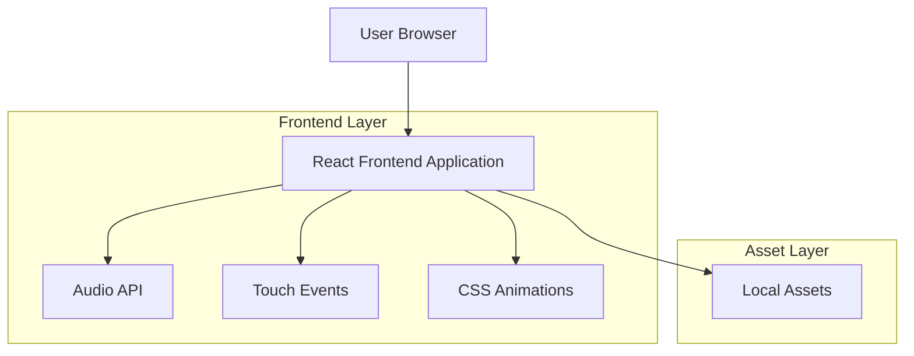

## 1. Architecture design



## 2. Technology Description
- Frontend: React@18 + tailwindcss@3 + vite
- Initialization Tool: vite-init
- Backend: None (client-side only application)
- Audio: Web Audio API with HTML5 audio elements
- Touch: Native touch event handlers
- Animations: CSS3 transforms and transitions

## 3. Route definitions
| Route | Purpose |
|-------|---------|
| / | Landing page with romantic proposal and dynamic buttons |
| /gallery | Swipeable 6-page photo gallery with audio |
| /letter | Auto-typing love letter with synchronized audio |

## 4. Component Architecture

### 4.1 Core Components

**LandingPage Component**
```typescript
interface LandingPageProps {
  onYesClick: () => void;
  onNoClick: () => void;
  yesButtonSize: number;
  noButtonSize: number;
}
```

**SwipeGallery Component**
```typescript
interface SwipeGalleryProps {
  photos: PhotoData[];
  onComplete: () => void;
}

interface PhotoData {
  id: number;
  imageUrl: string;
  message: string;
  audioUrl: string;
  backgroundColor: string;
}
```

**LoveLetter Component**
```typescript
interface LoveLetterProps {
  letterText: string;
  audioUrl: string;
  typingSpeed: number; // characters per second
}
```

### 4.2 Audio Management
```typescript
interface AudioManager {
  playAudio(url: string): Promise<void>;
  pauseAudio(): void;
  setVolume(level: number): void;
  getCurrentTime(): number;
  seekTo(time: number): void;
}
```

### 4.3 Touch Gesture Handling
```typescript
interface SwipeHandler {
  onSwipeLeft: () => void;
  onSwipeRight: () => void;
  onSwipeUp: () => void;
  onSwipeDown: () => void;
  threshold: number; // minimum swipe distance
}
```

## 5. State Management

### 5.1 Application State
```typescript
interface AppState {
  currentPage: 'landing' | 'gallery' | 'letter';
  galleryPage: number; // 0-5 for 6 pages
  buttonSizes: {
    yes: number; // percentage
    no: number; // percentage
  };
  audioPlaying: boolean;
  letterProgress: number; // typing progress percentage
}
```

### 5.2 Local Storage
- User interaction history
- Audio playback preferences
- Gallery progress tracking

## 6. Performance Optimization

### 6.1 Asset Loading Strategy
- Lazy loading for images
- Audio preloading for smooth transitions
- Progressive image loading for large photos
- Service worker for offline capability

### 6.2 Animation Performance
- Hardware-accelerated CSS transforms
- RequestAnimationFrame for smooth animations
- Debounced resize handlers
- Optimized re-renders with React.memo

## 7. Browser Compatibility
- Chrome 90+: Full feature support
- Firefox 88+: Full feature support  
- Safari 14+: Full feature support
- Edge 90+: Full feature support
- Mobile browsers: Touch gesture support

## 8. Accessibility Features
- Keyboard navigation support
- Screen reader compatibility
- High contrast mode support
- Audio controls with keyboard shortcuts
- ARIA labels for interactive elements

## 9. Testing Strategy
- Unit tests for component logic
- Integration tests for user flows
- Performance testing for 60fps animations
- Cross-browser compatibility testing
- Touch gesture testing on multiple devices
- Audio playback testing across browsers